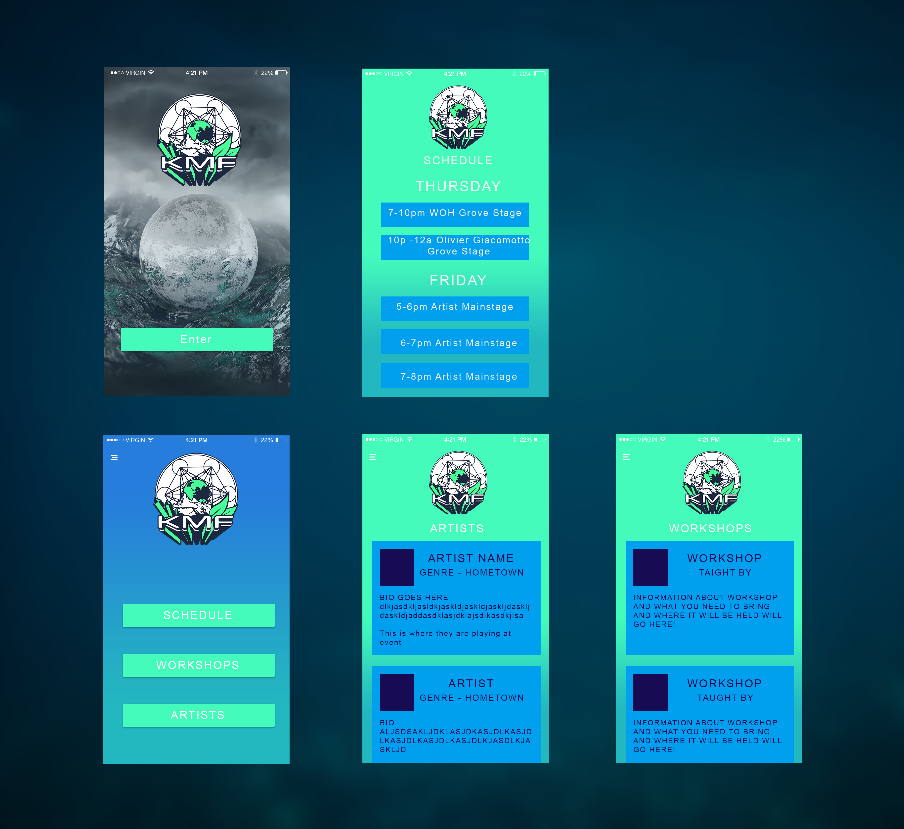
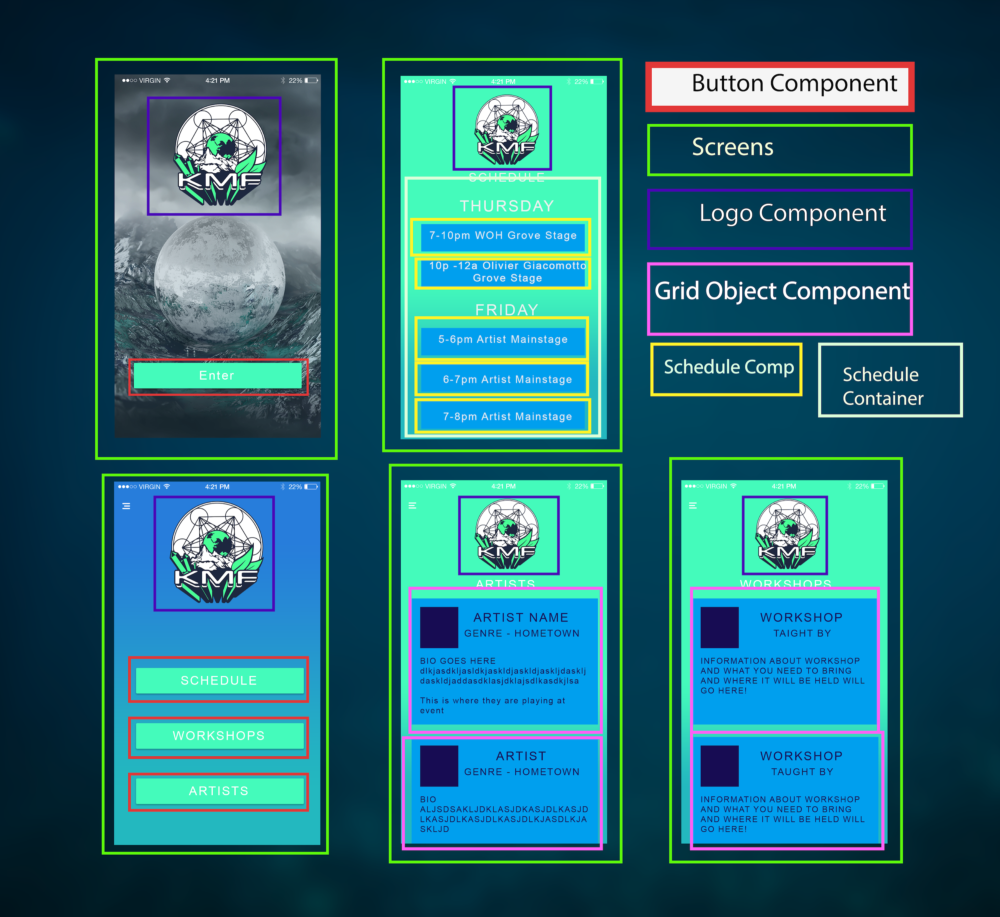
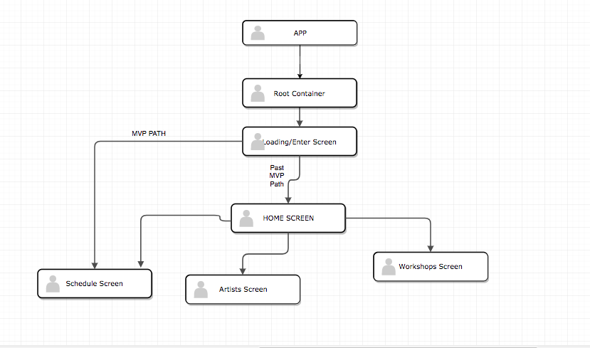

# Name of Student: Sam Kissee

## Name of Project: Konnexion Music Festival App

###Project’s Purpose or Goal: Allow offline access to schedule and activities

color code

green #44fbbb
purple text #170c53
rectangle color #009fee

List the absolute minimum features the project requires to meet this purpose or goal:

* Loading Screen
* Home Page With the weekends Music Schedule

What tools, frameworks, libraries, APIs, modules and/or other resources (whatever is specific to your track, and your language) will you use to create this MVP? List them all here. Be specific.

* React Native
* Possibly Ignite or Another CLI

If you finish developing the minimum viable product (MVP) with time to spare, what will you work on next? Describe these features here: Be specific.

* Workshop Schedule Page
* Live Update Schedule Page - Shows what is happening currently, what just happened, and will happen next.
* Artist Page - List of Artists and their Bio

We'll use these steps to plan and develop our capstones over the next two Fridays.

1. Break the UI into a Component Hierarchy

# Project Layout MVP:
  Home/Loading Screen with enter button to enter into the app:

  Next Screen Shows The Full Weekends Music Schedule on one page.

#  Project Layout past MVP:

  Home/Loading Screen with enter button to enter into the app:

  Next Screen Shows a menu with options to look at artists/ workshops/ or schedules

  This Home screen will show what artists the last artist to have played, who is playing now, and who is playin next. <- This will only work on weekend of event if all goes well.

  Artist Page will be a grid layout of each artist. Picture, name, short bio, style of music, when they play.

  Workshop will be a grid layout of all the workshops in order of when they will be happening, they will have a brief description of what the workshop is about and who is teaching it and when and where it will be happening.

  

  

  
